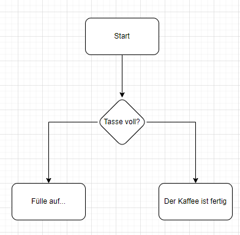

# Wahrheitswerte
Wahrheitswerte ermöglichen es uns, unseren Code in Abhängigkeit von bestimmten Bedingungen auszuführen. In diesem Kapitel werden wir uns die verschiedenen Arten von Wahrheitswerten ansehen, die in Java verfügbar sind.

## Boolesche Werte
Boolesche Werte sind Wahrheitswerte, die entweder `true` oder `false` sein können. Sie werden verwendet, um Bedingungen in Java zu überprüfen. Hier ist ein Beispiel:

```java
boolean a = true;
boolean b = false;
```

## Vergleichsoperatoren
Vergleichsoperatoren werden verwendet, um zwei Werte zu vergleichen. Sie geben einen booleschen Wert zurück, der angibt, ob die Bedingung erfüllt ist oder nicht. Hier ist eine Liste der Vergleichsoperatoren, die in Java verfügbar sind:

| Operator | Beschreibung     | Beispiel mit Zahlen | Ergebnis mit Zahlen | Beispiel mit Strings | Ergebnis mit Strings |
|----------|------------------|--------------------|---------------------|----------------------|----------------------|
| ==       | Gleich           | 10 == 5            | false               | "Hello" == "World"   | false                |
| !=       | Ungleich         | 10 != 5            | true                | "Hello" != "World"   | true                 |
| >        | Größer als       | 10 > 5             | true                | -                    | -                    |
| <        | Kleiner als      | 10 < 5             | false               | -                    | -                    |
| >=       | Größer gleich    | 10 >= 5            | true                | -                    | -                    |
| <=       | Kleiner gleich   | 10 <= 5            | false               | -                    | -                    |

### Strings vergleichen
Strings können nicht mit den Vergleichsoperatoren `==` und `!=` verglichen werden. Stattdessen müssen wir die `equals()`-Methode verwenden. 
Vergleichen wir zwei Strings mit `==` oder `!=`, werden wir die Referenzen der Strings vergleichen. Das bedeutet, dass wir überprüfen, ob die beiden Strings auf das gleiche Objekt verweisen.

Ein Besiiel für den Objektvergleich:

```java
String a = new String("Hello");
String b = new String("Hello");

if (a == b) {
    System.out.println("a ist gleich b"); // Wird nicht ausgeführt
} else {
    System.out.println("a ist ungleich b"); // Wird ausgeführt
}
```


Hier ist ein Beispiel, wie wir zwei Strings mit der `equals()`-Methode vergleichen können:

```java
String a = new String("Hello");
String b = new String("Hello");

if (a.equals(b)) {
    System.out.println("a ist gleich b"); // Wird ausgeführt
} else {
    System.out.println("a ist ungleich b"); // Wird nicht ausgeführt
}
```


## Logische Operatoren
Logische Operatoren werden verwendet, um mehrere Wahrheitswerte zu kombinieren. Hier ist eine Liste der logischen Operatoren, die in Java verfügbar sind:

| Operator | Beschreibung     | Beispiel  | Ergebnis | 
|----------|------------------|--------------------|---------------------|
| &&       | Und              | true && false      | false               | 
| \|\|     | Oder             | true \|\| false    | true                | 
| !        | Nicht            | !true              | false               |


# Konditionen
Konditionen oder auch Verzweigungen sind ein wichtiger Bestandteil der Programmierung. Sie ermöglichen es uns, unseren Code in Abhängigkeit von bestimmten Bedingungen auszuführen. In diesem Kapitel werden wir uns die verschiedenen Arten von Konditionen ansehen, die in Java verfügbar sind.

## if-else
Die `if`-Anweisung ist die grundlegendste Art von Kondition in Java. Sie ermöglicht es uns, einen Codeblock nur dann auszuführen, wenn eine bestimmte Bedingung erfüllt ist. Hier ist ein Beispiel:

```java
int a = 5;
int b = 10;

if (a < b) {
    System.out.println("a ist kleiner als b");
}
```

In diesem Beispiel wird der Code innerhalb der geschweiften Klammern nur dann ausgeführt, wenn die Bedingung `a < b` erfüllt ist. Wenn die Bedingung nicht erfüllt ist, wird der Codeblock übersprungen.

Die `if`-Anweisung kann auch mit einer `else`-Klausel verwendet werden, um einen alternativen Codeblock auszuführen, wenn die Bedingung nicht erfüllt ist. Hier ist ein Beispiel:

```java
int a = 5;
int b = 10;

if (a < b) {
    System.out.println("a ist kleiner als b");
} else {
    System.out.println("a ist größer als b");
}
```

In diesem Beispiel wird der Code innerhalb der geschweiften Klammern nach dem `else`-Schlüsselwort ausgeführt, wenn die Bedingung `a < b` nicht erfüllt ist.

## else if
Die `else-if`-Anweisung ist eine Erweiterung der `if`-Anweisung, die es uns ermöglicht, mehrere Bedingungen zu überprüfen. Hier ist ein Beispiel:

```java
int a = 5;
int b = 10;

if (a < b) {
    System.out.println("a ist kleiner als b");
} else if (a > b) {
    System.out.println("a ist größer als b");
} else {
    System.out.println("a ist gleich b");
}
```

In diesem Beispiel wird der Code innerhalb der geschweiften Klammern nach dem `else if`-Schlüsselwort ausgeführt, wenn die Bedingung `a < b` nicht erfüllt ist. Wenn die Bedingung `a > b` erfüllt ist, wird der Code innerhalb der geschweiften Klammern nach dem `else if`-Schlüsselwort ausgeführt. Wenn keine der Bedingungen erfüllt ist, wird der Code innerhalb der geschweiften Klammern nach dem `else`-Schlüsselwort ausgeführt.

## Nested if
Die `if`-Anweisung kann auch innerhalb eines anderen `if`-Blocks verwendet werden. Dies wird als "verschachtelte" `if`-Anweisung bezeichnet. Hier ist ein Beispiel:

```java
int a = 5;
int b = 10;

if (a < b) {
    if (a > 0) {
        System.out.println("a ist kleiner als b und größer als 0");
    }
}
```

In diesem Beispiel wird der Code innerhalb der geschweiften Klammern nach dem `if`-Schlüsselwort ausgeführt, wenn die Bedingung `a < b` erfüllt ist. Wenn die Bedingung `a > 0` erfüllt ist, wird der Code innerhalb der geschweiften Klammern nach dem `if`-Schlüsselwort ausgeführt.

## Ternärer Operator
Der ternäre Operator ist eine kompakte Möglichkeit, eine `if`-Anweisung in Java zu schreiben. Hier ist ein Beispiel:

```java
int a = 5;
int b = 10;

String result = (a < b) ? "a ist kleiner als b" : "a ist größer als b";
System.out.println(result);
```

## switch

Die `switch`-Anweisung ist eine weitere Möglichkeit, Bedingungen in Java zu verwenden. Sie ermöglicht es uns, einen Codeblock auszuführen, der von einem Ausdruck abhängt. Hier ist ein Beispiel:

```java
int day = 3;
switch (day) {
    case 1:
        System.out.println("Montag");
        break;
    case 2:
        System.out.println("Dienstag");
        break;
    case 3:
        System.out.println("Mittwoch");
        break;
    // Weitere Fälle...
    default:
        System.out.println("Ungültiger Tag");
}

```

```java
public static void main(String[] args) {
    int day = 3;
    String dayOfWeek = switch (day) {
        case 1, 7 -> "Wochenende";
        case 2, 3, 4, 5, 6 -> "Werktag";
        default -> "Ungültiger Tag";
    };

    System.out.println(dayOfWeek);
}
```

In diesem Beispiel wird der Code innerhalb der geschweiften Klammern nach dem `case`-Schlüsselwort ausgeführt, wenn der Wert von `a` mit dem Wert nach dem `case`-Schlüsselwort übereinstimmt. Wenn keine der Bedingungen erfüllt ist, wird der Code innerhalb der geschweiften Klammern nach dem `default`-Schlüsselwort ausgeführt.

# Challenge 1 - Coffee
Löse die Challenge in der Datein `Challenges/Coffee.java`.


